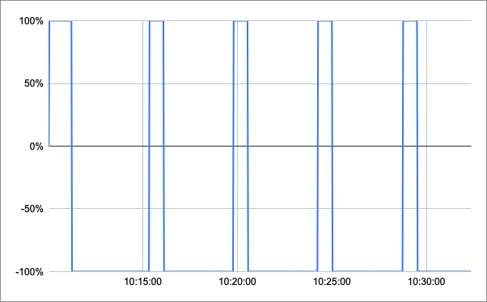

# Trabalho 1 - FSE

## **Resumo**

Este projeto é o primeiro trabalho da matéria de Fundamentos de Sistemas Embarcados da Universidade de Brasília (UnB) no semestre 2021.1.

Ele tem por objetivo a implementação dosoftware de uma bancada para testes de controle de temperatura de um sistema que possui internamente para alterar sua temperatura (um resistor e uma ventoinha).

|Nome|Matrícula|
|----|---------|
|Calebe Rios de Sousa Mendes|15/0120702|

## **Como rodar**

O projeto utiliza o `Makefile` para compilar e rodar tudo. Alguns comandos para se utilizar:

Para compilar o projeto:
```bash
make all
```

Para rodar o projeto:
```bash
make run
```

Para limpar o projeto:
```bash
make clean
```

## **Relatório**

Os relatórios serão divididos em 2 partes: On/Off e PID.

Obs: Todos os arquivos de log estão na pasta doc.

### **On/Off**

Essa estratégia liga o resistor ou a ventoinha em 100% de intensidade para manter uma temperatura de acordo com uma histerese.

Foi dividido em 2 partes, uma onde a temperatura de referência foi pega pelo terminal e a outra foi pega pelo potênciometro:

#### **Terminal**

Os resultados desse relatório foi baseado nesse [csv](doc/OnOff-Term/on-off.csv).




#### **Potênciometro**

Os resultados desse relatório foi baseado nesse [csv](doc/OnOff-Pot/on-off.csv).


### **PID**

Essa estratégia liga o resistor ou a ventoinha em uma intensidade determinada pelo calculo do PID.

Foi dividido em 2 partes, uma onde a temperatura de referência foi pega pelo terminal e a outra foi pega pelo potênciometro:

#### **Terminal**

Os resultados desse relatório foi baseado nesse [csv](doc/PID-Term/pid.csv).


#### **Potênciometro**

Os resultados desse relatório foi baseado nesse [csv](doc/PID-Pot/pid.csv).


## **Mais informações**

Neste projeto foram utilizados as seguintes bibliotecas:

- BME280
- CRC
- I2C
- WiringPI
- SoftPWM
- UART
